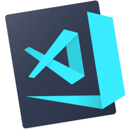
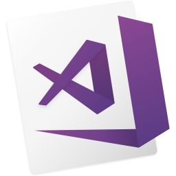

 

<h1 align="center">
  
</h1>

<h5 align="center">
  <code><a href="https://www.linkedin.com/in/awahids/" title="LinkedIn Profile"> LinkedIn</a></code>
  <code><a href="https://www.instagram.com/awhds_/" title="Instagram Profile"> Instagram</a></code>
</h5>
 

  Hi, I'm Wahid, Backend Developer from Sumbawa, West Nusa Tenggara
   
   
  🔬 I'm currently Working at Fintech Sharia
   
  🎓 I graduated from Mataram University, Informatics Engineer
   
  💻 I love writing code and learn anythings about it
   
  📚 I’m currently learning Golang
   
  💬 Ask me anything about from <a href="https://github.com/awahids/awahids/issues" title="Issues">Here</a>
   
  📫 How to reach me: <a href="mailto: awahid.safhadi@gmail.com">awahid.safhadi@gmail.com</a>

<h2 align="center">🔥 Languages & Frameworks & Tools & Abilities 🔥</h2>
 

  <code></code>
  <code></code>
  <code></code>
  <code></code>
  <code></code>
  <code></code>
  <code></code>
  <code></code>
  <code></code>
  <code></code>
  <code></code>
  <code></code>
  <code></code>
  <code></code>
  <code></code>
  <code></code>
  <code></code>
  <code></code>

<h2 align="center">⚡ Stats ⚡</h2>
 

  

    
     
    
    
  

   
  

